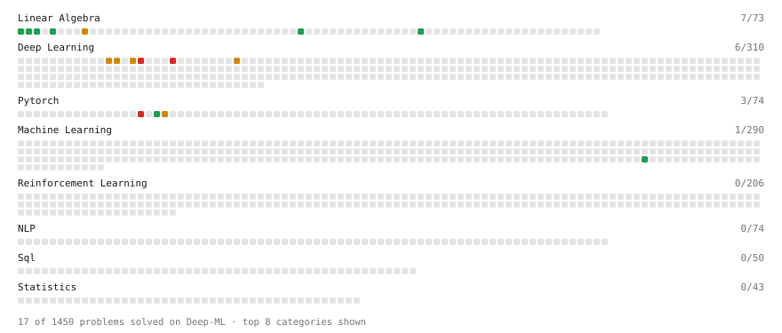

# Deep-ML

My machine learning practice from [Deep-ML](https://www.deep-ml.com). Every solution here was written by hand.

**18** solved · 13 problems · 0 labs · 5 math

[**Browse the interactive portfolio**](https://yuex-ai.github.io/deep-ml/) to replay this filling in over time.

## Problems

| | Difficulty | Solved | |
| --- | --- | --- | --- |
| [L2 Normalization Along an Axis](https://www.deep-ml.com/problems/1022) | easy | 2026-09-26 | [solution](problems/1022-l2-normalization-along-an-axis) |
| [Pairwise Cosine Similarity Matrix](https://www.deep-ml.com/problems/1072) | easy | 2026-09-26 | [solution](problems/1072-pairwise-cosine-similarity-matrix) |
| [Sinusoidal Positional Encoding](https://www.deep-ml.com/problems/906) | easy | 2026-09-24 | [solution](problems/0906-sinusoidal-positional-encoding) |
| [Transpose of a Matrix](https://www.deep-ml.com/problems/2) | easy | 2026-09-25 | [solution](problems/0002-transpose-of-a-matrix) |
| [Vector Norms (L1/L2/L-inf) and the Frobenius Norm](https://www.deep-ml.com/problems/328) | easy | 2026-09-26 | [solution](problems/0328-vector-norms-l1-l2-l-inf-and-the-frobenius-norm) |
| [Implement an LSTM Cell from Scratch](https://www.deep-ml.com/problems/907) | medium | 2026-09-19 | [solution](problems/0907-implement-an-lstm-cell-from-scratch) |
| [Implement Long Short-Term Memory (LSTM) Network](https://www.deep-ml.com/problems/59) | medium | 2026-09-19 | [solution](problems/0059-implement-long-short-term-memory-lstm-network) |
| [Implement Masked Self-Attention](https://www.deep-ml.com/problems/107) | medium | 2026-09-23 | [solution](problems/0107-implement-masked-self-attention) |
| [Implement Self-Attention Mechanism](https://www.deep-ml.com/problems/53) | medium | 2026-09-23 | [solution](problems/0053-implement-self-attention-mechanism) |
| [Implementing a Simple RNN](https://www.deep-ml.com/problems/54) | medium | 2026-09-18 | [solution](problems/0054-implementing-a-simple-rnn) |
| [Implement a Simple RNN with Backpropagation Through Time (BPTT)](https://www.deep-ml.com/problems/62) | hard | 2026-09-18 | [solution](problems/0062-implement-a-simple-rnn-with-backpropagation-through-time-bptt) |
| [Implement Multi-Head Attention](https://www.deep-ml.com/problems/94) | hard | 2026-09-24 | [solution](problems/0094-implement-multi-head-attention) |
| [Implement Multi-Head Self-Attention](https://www.deep-ml.com/problems/904) | hard | 2026-09-24 | [solution](problems/0904-implement-multi-head-self-attention) |

## Math

| | Difficulty | Solved | |
| --- | --- | --- | --- |
| [Matrix Basics](https://www.deep-ml.com/math-problems/9) | easy | 2026-09-25 | [solution](math/0009-matrix-basics) |
| [Information Theory: Entropy](https://www.deep-ml.com/math-problems/24) | medium | 2026-09-16 | [solution](math/0024-information-theory-entropy) |
| [Matrix Multiplication](https://www.deep-ml.com/math-problems/10) | medium | 2026-09-25 | [solution](math/0010-matrix-multiplication) |
| [KL Divergence](https://www.deep-ml.com/math-problems/25) | hard | 2026-09-18 | [solution](math/0025-kl-divergence) |
| [Maximum Likelihood and MAP](https://www.deep-ml.com/math-problems/26) | hard | 2026-09-19 | [solution](math/0026-maximum-likelihood-and-map) |

---

_This file is regenerated by Deep-ML on every push._
