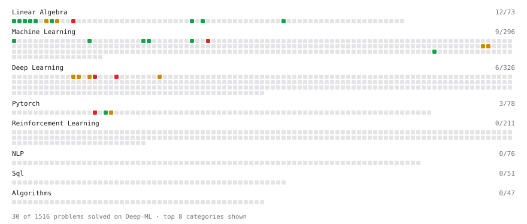

# Deep-ML

My machine learning practice from [Deep-ML](https://www.deep-ml.com). Every solution here was written by hand.

**36** solved · 28 problems · 0 labs · 8 math

[**Browse the interactive portfolio**](https://yuex-ai.github.io/deep-ml/) to replay this filling in over time.

## Problems

| | Difficulty | Solved | |
| --- | --- | --- | --- |
| [Calculate 2x2 Matrix Inverse](https://www.deep-ml.com/problems/8) | easy | 2026-09-29 | [solution](problems/0008-calculate-2x2-matrix-inverse) |
| [Calculate Mean Absolute Error (MAE)](https://www.deep-ml.com/problems/93) | easy | 2026-10-08 | [solution](problems/0093-calculate-mean-absolute-error-mae) |
| [Calculate Mean by Row or Column](https://www.deep-ml.com/problems/4) | easy | 2026-09-26 | [solution](problems/0004-calculate-mean-by-row-or-column) |
| [Calculate R-squared for Regression Analysis](https://www.deep-ml.com/problems/69) | easy | 2026-10-08 | [solution](problems/0069-calculate-r-squared-for-regression-analysis) |
| [Calculate Root Mean Square Error (RMSE)](https://www.deep-ml.com/problems/71) | easy | 2026-10-08 | [solution](problems/0071-calculate-root-mean-square-error-rmse) |
| [L2 Normalization Along an Axis](https://www.deep-ml.com/problems/1022) | easy | 2026-09-26 | [solution](problems/1022-l2-normalization-along-an-axis) |
| [Linear Regression Using Normal Equation](https://www.deep-ml.com/problems/14) | easy | 2026-09-27 | [solution](problems/0014-linear-regression-using-normal-equation) |
| [Matrix Determinant & Trace](https://www.deep-ml.com/problems/195) | easy | 2026-09-28 | [solution](problems/0195-matrix-determinant-trace) |
| [Matrix-Vector Dot Product](https://www.deep-ml.com/problems/1) | easy | 2026-09-26 | [solution](problems/0001-matrix-vector-dot-product) |
| [Pairwise Cosine Similarity Matrix](https://www.deep-ml.com/problems/1072) | easy | 2026-09-26 | [solution](problems/1072-pairwise-cosine-similarity-matrix) |
| [Reshape Matrix](https://www.deep-ml.com/problems/3) | easy | 2026-09-26 | [solution](problems/0003-reshape-matrix) |
| [Scalar Multiplication of a Matrix](https://www.deep-ml.com/problems/5) | easy | 2026-09-26 | [solution](problems/0005-scalar-multiplication-of-a-matrix) |
| [Sinusoidal Positional Encoding](https://www.deep-ml.com/problems/906) | easy | 2026-09-24 | [solution](problems/0906-sinusoidal-positional-encoding) |
| [Transpose of a Matrix](https://www.deep-ml.com/problems/2) | easy | 2026-09-25 | [solution](problems/0002-transpose-of-a-matrix) |
| [Vector Norms (L1/L2/L-inf) and the Frobenius Norm](https://www.deep-ml.com/problems/328) | easy | 2026-09-26 | [solution](problems/0328-vector-norms-l1-l2-l-inf-and-the-frobenius-norm) |
| [Implement an LSTM Cell from Scratch](https://www.deep-ml.com/problems/907) | medium | 2026-09-19 | [solution](problems/0907-implement-an-lstm-cell-from-scratch) |
| [Implement Long Short-Term Memory (LSTM) Network](https://www.deep-ml.com/problems/59) | medium | 2026-09-19 | [solution](problems/0059-implement-long-short-term-memory-lstm-network) |
| [Implement Masked Self-Attention](https://www.deep-ml.com/problems/107) | medium | 2026-09-23 | [solution](problems/0107-implement-masked-self-attention) |
| [Implement Self-Attention Mechanism](https://www.deep-ml.com/problems/53) | medium | 2026-09-23 | [solution](problems/0053-implement-self-attention-mechanism) |
| [Implementing a Simple RNN](https://www.deep-ml.com/problems/54) | medium | 2026-09-18 | [solution](problems/0054-implementing-a-simple-rnn) |
| [Matrix times Matrix ](https://www.deep-ml.com/problems/9) | medium | 2026-09-26 | [solution](problems/0009-matrix-times-matrix) |
| [Matrix Transformation ](https://www.deep-ml.com/problems/7) | medium | 2026-09-26 | [solution](problems/0007-matrix-transformation) |
| [Mini-Batch Gradient Descent Step for Linear Regression](https://www.deep-ml.com/problems/803) | medium | 2026-10-04 | [solution](problems/0803-mini-batch-gradient-descent-step-for-linear-regression) |
| [Stochastic Gradient Descent Step for Linear Regression](https://www.deep-ml.com/problems/802) | medium | 2026-10-04 | [solution](problems/0802-stochastic-gradient-descent-step-for-linear-regression) |
| [Determinant of a 4x4 Matrix using Laplace's Expansion (hard)](https://www.deep-ml.com/problems/13) | hard | 2026-09-29 | [solution](problems/0013-determinant-of-a-4x4-matrix-using-laplace-s-expansion-hard) |
| [Implement a Simple RNN with Backpropagation Through Time (BPTT)](https://www.deep-ml.com/problems/62) | hard | 2026-09-18 | [solution](problems/0062-implement-a-simple-rnn-with-backpropagation-through-time-bptt) |
| [Implement Multi-Head Attention](https://www.deep-ml.com/problems/94) | hard | 2026-09-24 | [solution](problems/0094-implement-multi-head-attention) |
| [Implement Multi-Head Self-Attention](https://www.deep-ml.com/problems/904) | hard | 2026-09-24 | [solution](problems/0904-implement-multi-head-self-attention) |

## Math

| | Difficulty | Solved | |
| --- | --- | --- | --- |
| [Matrix Basics](https://www.deep-ml.com/math-problems/9) | easy | 2026-09-25 | [solution](math/0009-matrix-basics) |
| [Determinants and Trace](https://www.deep-ml.com/math-problems/11) | medium | 2026-09-27 | [solution](math/0011-determinants-and-trace) |
| [Information Theory: Entropy](https://www.deep-ml.com/math-problems/24) | medium | 2026-09-16 | [solution](math/0024-information-theory-entropy) |
| [Inverse and Rank](https://www.deep-ml.com/math-problems/12) | medium | 2026-09-27 | [solution](math/0012-inverse-and-rank) |
| [Matrix Multiplication](https://www.deep-ml.com/math-problems/10) | medium | 2026-09-25 | [solution](math/0010-matrix-multiplication) |
| [The Four Fundamental Subspaces](https://www.deep-ml.com/math-problems/46) | medium | 2026-09-27 | [solution](math/0046-the-four-fundamental-subspaces) |
| [KL Divergence](https://www.deep-ml.com/math-problems/25) | hard | 2026-09-18 | [solution](math/0025-kl-divergence) |
| [Maximum Likelihood and MAP](https://www.deep-ml.com/math-problems/26) | hard | 2026-09-19 | [solution](math/0026-maximum-likelihood-and-map) |

---

_This file is regenerated by Deep-ML on every push._
